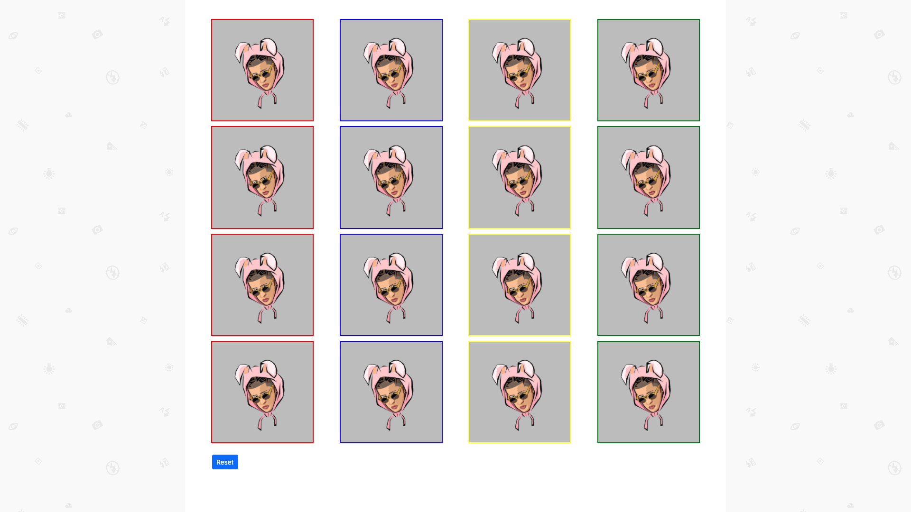

# DissapearingImg
  This page loads images and divides them into rows and evenly spread out columns. Every time an image is clicked it dissapears using jQuery. To show all the images
  back to their normal state all a user has to do is press the 'reset' button.
  
# What I learned
  * Practice jQuery
  * Use of display flex
 
  
# Screenshots

